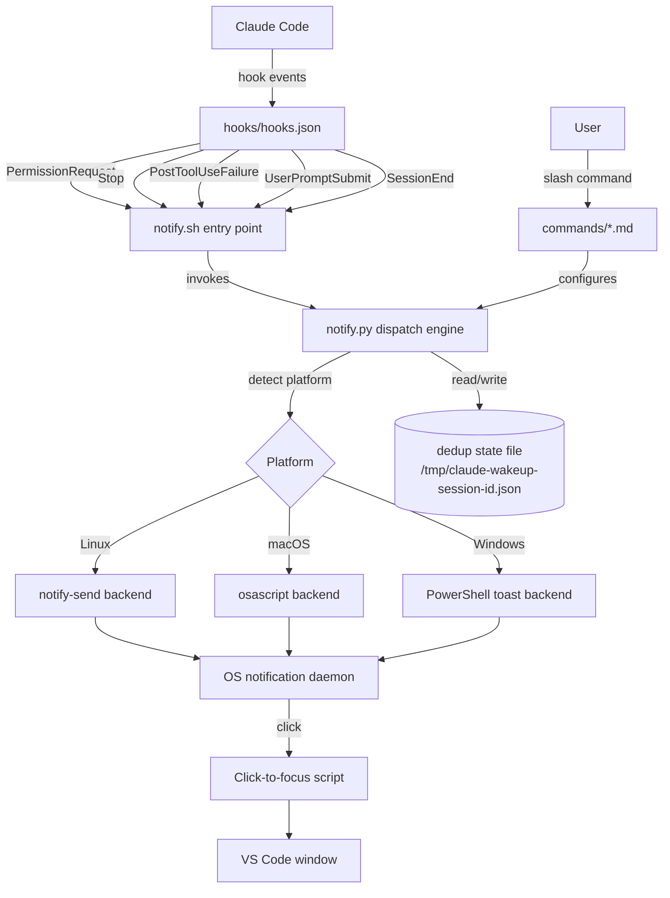
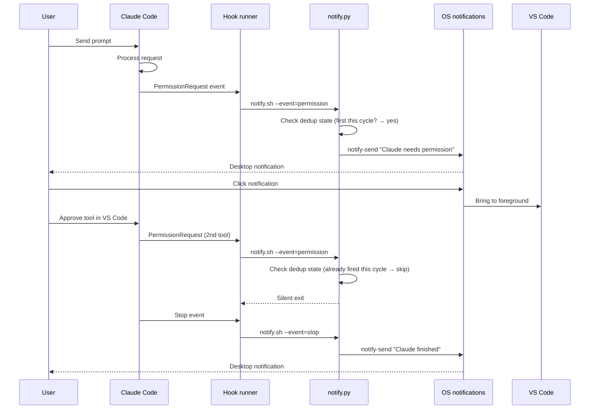

## Summary

A Claude Code plugin that sends OS-native desktop notifications when Claude needs user attention — permission prompts, task completion, and errors. Users install by enabling the plugin and running a config slash command; no hand-editing of hook entries or settings. Clicking a notification brings VS Code to the foreground.

---

## Problem Frame

When using Claude Code in VS Code, users launch work, switch to other tasks, and have no way to know when Claude needs them back. The current workaround is manual alt-tabbing — a tax that burns attention on both sides. This plugin closes that gap using Claude Code's native hook system and OS notification infrastructure. Delivering it as a plugin rather than manual hook scripts means installation is a single step (enable the plugin) and configuration happens through slash commands rather than hand-editing JSON.

---

## Requirements

These requirements are carried forward from the origin document. See `docs/brainstorms/2026-06-04-claude-wakeup-notifications-requirements.md` for full rationale.

**Event Detection**

- R1. When Claude Code is blocked waiting for tool-use permission, the system sends a notification.
- R2. When Claude Code completes a response (the session returns to idle), the system sends a notification.
- R3. When Claude Code encounters an error or cannot proceed without user intervention, the system sends a notification.

**Notification Content**

- R4. Each notification includes a summary of the event: what Claude is waiting for, what completed, or what went wrong.
- R5. Notifications identify the project or session that triggered them.

**Notification Behavior**

- R6. Clicking a notification brings VS Code to the foreground with focus on the Claude Code session.
- R7. Multiple tool-use permission waits within a single response cycle produce at most one notification.
- R8. Notifications are delivered within a few seconds of the state transition.

**Installation and Configuration**

- R9. Installation consists of enabling the plugin and running a configuration slash command — no hand-editing of settings or hook entries.
- R10. The system works cross-platform using each platform's native notification mechanism.

**Failure Handling**

- R11. If the OS notification mechanism is unavailable, the system fails silently without blocking or interrupting Claude Code.

---

## Key Technical Decisions

- **Plugin packaging over manual script installation.** The brainstorm assumed copying hook scripts and hand-editing `.claude/settings.json`. Packaging as a Claude Code plugin with `hooks/hooks.json` and slash commands eliminates manual configuration entirely — the user enables the plugin and runs a config command. Plugin hooks reference scripts via `${CLAUDE_PLUGIN_ROOT}` so paths are self-contained.

- **Python for the dispatch engine over Bash.** Cross-platform dispatch to three notification backends, JSON state management for dedup, graceful subprocess timeouts, and the requirement to never block or hang — this is the exact profile the institutional learning flags as a Bash footgun. Python's `subprocess.run(check=False, timeout=N)` and `json` module handle each concern directly without `set -euo pipefail` edge cases. macOS still ships Bash 3.2, which lacks features the script would need.

- **`PermissionRequest` hook over `PreToolUse` for permission notifications (R1).** `PermissionRequest` fires specifically when Claude needs user approval; `PreToolUse` fires for every tool call including auto-approved ones. Using `PermissionRequest` means the notification fires only when Claude is actually blocked waiting, which eliminates most false positives and simplifies dedup.

- **`UserPromptSubmit` resets the dedup state for the next response cycle.** A new user message starts a fresh cycle — the first `PermissionRequest` after that fires a notification again. The state file tracks the last notification type per cycle so the hook script can decide whether to fire or suppress.

- **Per-session dedup via a state file over environment variables.** Hook invocations are independent processes; environment variables don't persist between them. A small JSON file in the session temp directory (`/tmp/claude-wakeup-<session-id>.json`) survives across hook calls within a session and is cleaned up on `SessionEnd`.

- **Normalization-at-boundaries for platform dispatch.** A single `dispatch(title, message, urgency, action)` function accepts a structured payload. Three platform backends (Linux/`notify-send`, macOS/`osascript`, Windows/PowerShell toast) translate to native command syntax. This mirrors the established cross-platform normalization pattern and keeps OS conditionals encapsulated.

---

## High-Level Technical Design

### Component architecture



### Notification lifecycle



---

## Output Structure

This plan creates a new plugin directory hierarchy:

```
.claude-plugin/
  plugin.json
hooks/
  hooks.json
  notify.sh
notify.py
commands/
  config.md
  test.md
  status.md
Makefile
README.md
tests/
  test_notify.py
  test_hooks_config.py
```

---

## Implementation Units

### U1. Plugin scaffold and manifest

- **Goal:** Create the Claude Code plugin identity, hook bindings, and directory structure so the plugin is discoverable and hook events route to the dispatch script.
- **Requirements:** R9, F1
- **Dependencies:** None
- **Files:**
  - `.claude-plugin/plugin.json` (create)
  - `hooks/hooks.json` (create)
- **Approach:** Define the plugin manifest with `name: claude-wakeup`, metadata, and component paths pointing at `hooks/` and `commands/`. Wire `hooks/hooks.json` with five event entries: `PermissionRequest`, `Stop`, `PostToolUseFailure`, `UserPromptSubmit`, and `SessionEnd` — each pointing at `hooks/notify.sh` via `${CLAUDE_PLUGIN_ROOT}` with the event type passed as an argument. The `UserPromptSubmit` and `SessionEnd` entries are silent internal signals (they reset and clean up dedup state, respectively) and never produce user-visible notifications. Follow the hook spec: events map to matchers map to hook lists. Use a catch-all matcher (`""` or `"*"`) so every event instance fires the script.
- **Patterns to follow:** Claude Code plugin spec (`docs/specs/claude-code.md` in the compound-engineering plugin), Hookify plugin reference implementation.
- **Test scenarios:**
  - `plugin.json` is valid JSON with required fields (`name`, `version`, `hooks` component path)
  - `hooks.json` is valid JSON matching the hooks event/matcher/hook-list schema
  - All five hook event names (`PermissionRequest`, `Stop`, `PostToolUseFailure`, `UserPromptSubmit`, `SessionEnd`) are valid per the Claude Code spec
  - `${CLAUDE_PLUGIN_ROOT}` references resolve to paths within the plugin directory
- **Verification:** `plugin.json` passes JSON schema validation. `hooks.json` event names match the Claude Code hook spec. The plugin appears in `claude plugins list` after installation.

### U2. Python notification dispatch engine

- **Goal:** Implement the core dispatch logic — platform detection, notification backends, dedup state management, and notification content formatting — as a single Python module invoked by the hook entry point.
- **Requirements:** R1, R2, R3, R4, R5, R6, R7, R8, R10, R11, F2, F3, F4, AE1, AE2, AE3, AE4
- **Dependencies:** U1 (hooks.json defines the events that trigger this script)
- **Files:**
  - `notify.py` (create)
  - `tests/test_notify.py` (create)
- **Approach:** A single-file Python module with no dependencies beyond stdlib. Entry point accepts `--event <type>` (one of `permission`, `stop`, `error`, `cycle-reset`, `cleanup`). On invocation:
  1. Detect platform via `sys.platform` and select the appropriate notification backend.
  2. For user-visible events (`permission`, `stop`, `error`): check the dedup state file. If this event type was already sent this cycle, exit silently. Otherwise, construct the notification payload (title, summary message including project name, urgency level, click-action command) and dispatch through the platform backend.
  3. For `cycle-reset` (UserPromptSubmit): clear the dedup state file so the next permission event fires a new notification.
  4. For `cleanup` (SessionEnd): remove the dedup state file.
  5. All subprocess calls use `subprocess.run(check=False, timeout=5)`. Any failure (daemon unavailable, command not found, timeout) produces a silent exit.
  - Platform backends are internal functions: `_notify_linux(payload)`, `_notify_macos(payload)`, `_notify_windows(payload)`. Each translates the structured payload to the native command syntax.
  - The dedup state file lives at a path derived from the session identifier (read from an environment variable set by Claude Code, or from `CLAUDE_SESSION_ID` / a fallback derived from the project path). Its content is a small JSON object: `{"last_event": "permission", "session_pid": 12345}`.
- **Patterns to follow:** Normalization-at-boundaries pattern for platform dispatch. Agent-friendly CLI principles (non-interactive, bounded output, safe retries, idempotent). Prefer-Python-over-Bash institutional learning.
- **Test scenarios:**
  - Platform detection: `sys.platform` values for Linux, macOS, Windows map to correct backend
  - Linux backend: constructs valid `notify-send` command with `--urgency`, `--app-name`, `--action` for click-to-focus
  - macOS backend: constructs valid `osascript` with display notification command
  - Windows backend: constructs valid PowerShell toast invocation
  - Covers AE1. Dedup: first `--event=permission` writes state and returns exit code 0
  - Covers AE1. Dedup: second `--event=permission` in same cycle reads state and exits silently (exit code 0, no notification)
  - Dedup: `--event=stop` always fires regardless of prior permission notification
  - Dedup: `--event=cycle-reset` clears state so next permission fires again
  - Dedup: `--event=cleanup` removes state file
  - Covers AE3. Graceful failure: `notify-send` not found → silent exit, exit code 0
  - Covers AE3. Graceful failure: subprocess timeout → silent exit, exit code 0
  - Content: notification title includes project basename
  - Content: permission notification body names the tool waiting for approval
  - Content: stop notification body summarizes "task complete"
  - Content: error notification body includes error context
  - Covers AE2. Click action: notification includes a platform-appropriate click handler that focuses VS Code
  - Covers AE4. State file: uses session-scoped path, not a global path that would collide across concurrent sessions
  - State file: handles missing state file gracefully (treats as first event of cycle)
- **Verification:** `pytest tests/test_notify.py` passes. Manual verification: invoking `python notify.py --event=permission` in a terminal sends a desktop notification. Invoking it twice in succession sends only one notification.

### U3. Hook entry point and event wiring

- **Goal:** Provide the thin shell entry point that `hooks.json` invokes, which delegates to the Python engine with the correct event context.
- **Requirements:** R1, R2, R3, R7, F2, F3
- **Dependencies:** U1 (hooks.json must exist), U2 (notify.py must exist)
- **Files:**
  - `hooks/notify.sh` (create)
- **Approach:** A minimal shell script (compatible with POSIX sh, not bash-specific) that resolves the path to `notify.py` relative to `${CLAUDE_PLUGIN_ROOT}`, maps the hook event name from the environment or argument to the Python `--event` argument, and invokes Python. The mapping: `PermissionRequest` → `--event=permission`, `Stop` → `--event=stop`, `PostToolUseFailure` → `--event=error`, `UserPromptSubmit` → `--event=cycle-reset`, `SessionEnd` → `--event=cleanup`. If Python is not available, exit silently. Pass relevant environment variables (project path, session identifier, tool name) through to the Python process.
- **Patterns to follow:** Script-first skill architecture — the hook script is minimal glue; all logic lives in the Python engine. Hookify plugin reference for hook script structure.
- **Test scenarios:**
  - `PermissionRequest` hook invocation maps to `--event=permission`
  - `Stop` hook invocation maps to `--event=stop`
  - `PostToolUseFailure` hook invocation maps to `--event=error`
  - `UserPromptSubmit` hook invocation maps to `--event=cycle-reset`
  - `SessionEnd` hook invocation maps to `--event=cleanup`
  - Python not available → script exits 0 silently (does not block Claude Code)
  - `${CLAUDE_PLUGIN_ROOT}` resolves to the plugin's installed path
- **Verification:** Running each hook entry manually with a simulated `${CLAUDE_PLUGIN_ROOT}` invokes `notify.py` with the correct `--event` flag. Claude Code debug mode (`--debug hooks`) confirms hooks fire on the expected events.

### U4. Slash commands for configuration

- **Goal:** Provide slash commands so users can configure, test, and check the plugin without hand-editing files.
- **Requirements:** R9, F1
- **Dependencies:** U1 (plugin must be installed)
- **Files:**
  - `commands/config.md` (create)
  - `commands/test.md` (create)
  - `commands/status.md` (create)
- **Approach:** Three command files in `commands/`:
  - `/claude-wakeup:config` — walks the user through initial setup: verifies Python is available, checks that the platform notification daemon is reachable, sends a test notification, and confirms the plugin is active. Prompts for any user preferences (e.g., notification urgency default). Writes the resolved configuration for the Python engine to reference.
  - `/claude-wakeup:test` — sends an immediate test notification ("Claude Wakeup is working") so the user can verify end-to-end delivery and click-to-focus behavior.
  - `/claude-wakeup:status` — reports plugin state: whether hooks are active, which events are wired, when the last notification fired, and whether the notification daemon is reachable on the current platform.
  - Commands use `disable-model-invocation: true` where they only need to run a script (test, status). Config uses model involvement for the interactive setup dialogue.
- **Patterns to follow:** Claude Code command spec — markdown files with frontmatter including `description` and `argument-hint`. Commands delegate to scripts where possible rather than embedding logic.
- **Test scenarios:**
  - `/claude-wakeup:config` completes setup and produces a valid configuration
  - `/claude-wakeup:test` sends a test notification that the user can verify manually
  - `/claude-wakeup:status` reports accurate state when the plugin is active
  - `/claude-wakeup:status` reports issues when Python or the notification daemon is unavailable
- **Verification:** Run each command in a Claude Code session with the plugin enabled. Config produces no errors and test sends a visible notification.

### U5. Tests, build tooling, and documentation

- **Goal:** Provide a Makefile for install/test/lint, unit and integration tests, and plugin documentation so the project is maintainable and contributors can verify changes.
- **Requirements:** R9, R10, R11, F1
- **Dependencies:** U1 (test_hooks_config.py validates hooks.json created by U1), U2 (tests exercise the Python engine), U3 (integration tests exercise hook wiring)
- **Files:**
  - `Makefile` (create)
  - `tests/test_hooks_config.py` (create)
  - `README.md` (update)
- **Approach:**
  - `Makefile` with targets: `install` (symlink or copy plugin to `~/.claude/plugins/`), `test` (run pytest and shellcheck), `lint` (shellcheck on `hooks/notify.sh`, ruff or pyflakes on `notify.py`), `clean` (remove `__pycache__`, `.pyc`).
  - `tests/test_hooks_config.py` validates `hooks/hooks.json` structure: all event names are valid per the Claude Code spec, the hook command references `${CLAUDE_PLUGIN_ROOT}`, the JSON schema is well-formed.
  - `README.md` updated from the current one-line stub to document: what the plugin does, how to install (enable plugin + run config command), available slash commands, platform requirements, and troubleshooting.
- **Patterns to follow:** sbam project's `CLAUDE.md` conventions for documentation structure. Makefile conventions from the compound-engineering plugin.
- **Test scenarios:**
  - `make test` exits 0 when all tests pass
  - `make lint` exits 0 with no shellcheck or Python lint warnings
  - `make install` creates the expected symlink or copy under `~/.claude/plugins/`
  - `test_hooks_config.py`: validates all event names against the known Claude Code hook event set
  - `test_hooks_config.py`: validates `${CLAUDE_PLUGIN_ROOT}` appears in hook command paths
  - `test_hooks_config.py`: validates `hooks.json` matches the event → matcher → hook-list schema
- **Verification:** `make test && make lint` passes cleanly on a fresh checkout. `make install` followed by `claude plugins list` shows the plugin as available.

---

## Scope Boundaries

### Deferred for later

- Per-event-type notification toggles — the brainstorm deferred individual toggles for permission, completion, and error events. All three fire by default in v1.
- Notification history or persistence — missed notifications are not queued. The brainstorm scoped this out.
- Mobile or remote notifications — desktop-only for v1.

### Deferred to Follow-Up Work

- WSL2 notification bridge auto-detection — the plugin detects WSL2 and suggests bridge tools in documentation, but does not auto-install or auto-configure them. Manual setup documented in README.
- npm/pip distribution — the plugin is installed by cloning or copying into `~/.claude/plugins/`. Package manager distribution is deferred until there's demand.

---

## Risks & Dependencies

- **Claude Code hook API stability.** The plugin depends on `PermissionRequest`, `Stop`, `PostToolUseFailure`, `UserPromptSubmit`, and `SessionEnd` events remaining stable. If event names or semantics change in a future Claude Code release, notifications may silently stop firing. Mitigation: the `/claude-wakeup:status` command lets users verify hook wiring.
- **Python runtime availability.** The dispatch engine requires Python 3.8+. macOS and most Linux distributions ship Python 3, but minimal containers or constrained environments may not. Mitigation: the hook entry point (`notify.sh`) exits silently if Python is unavailable, so Claude Code is never blocked.
- **WSL2 notification bridging.** On WSL2, Linux `notify-send` may not reach the Windows notification center without a bridge tool. The plugin documents the setup but does not automate it in v1.
- **VS Code focus command availability.** Click-to-focus depends on platform-specific window management tools (`wmctrl` or `xdotool` on Linux, System Events on macOS, PowerShell on Windows). If these are unavailable, the notification still fires but clicking it may not focus VS Code. Mitigation: `/claude-wakeup:test` verifies the click-to-focus path and reports issues.

---

## Sources / Research

- Claude Code plugin and hooks spec — `docs/specs/claude-code.md` in the compound-engineering plugin. Confirmed hook event names (`PermissionRequest`, `Stop`, `PostToolUseFailure`, `UserPromptSubmit`, `SessionEnd`), hook JSON schema (event → matcher → hook list), and `${CLAUDE_PLUGIN_ROOT}` variable.
- Prefer-Python-over-Bash institutional learning — `docs/solutions/best-practices/prefer-python-over-bash-for-pipeline-scripts.md`. Applies directly to the cross-platform dispatch + state management profile.
- Normalization-at-boundaries pattern — `docs/solutions/integrations/cross-platform-model-field-normalization.md`. Mirrored for platform-specific notification backends behind a common dispatch interface.
- Agent-friendly CLI principles — `docs/solutions/agent-friendly-cli-principles.md`. Non-interactive execution, bounded output, safe retries, idempotent commands.
- Hookify plugin reference implementation — demonstrates `Stop` event usage, pattern-based conditional dispatch, and project-local hook configuration.
- Cross-platform colon-sanitization learning — `docs/solutions/integrations/colon-namespaced-names-break-windows-paths.md`. Session IDs with colons must be sanitized in state file paths on Windows.
